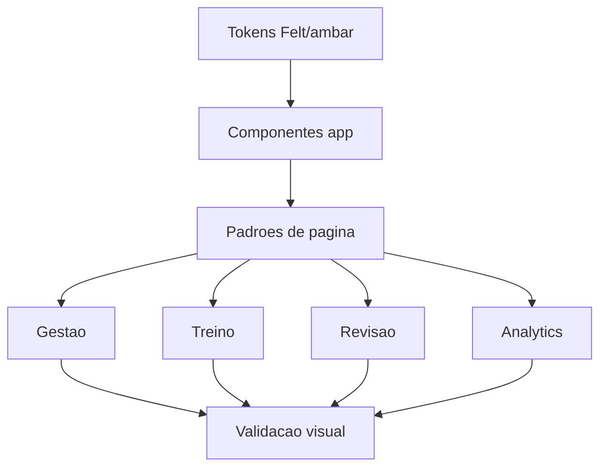

# Application Visual UX System Design

**Spec**: `.specs/features/app-visual-ux-system/spec.md`
**Status**: Complete

---

## Architecture Overview

A implementação deve evoluir a camada de UI do renderer sem tocar no domínio, IPC, DB ou avaliação. O trabalho deve ser guiado por quatro camadas:

1. **Tokens e fundamentos**: preservar paleta Felt/âmbar, tipografia Fraunces/Outfit, radii, borders, rings e semantic colors.
2. **Componentes de aplicação**: fortalecer `PageHeader`, `SectionCard`, `StatCard`, `EmptyState`, `FilterToolbar`, tabelas, toolbars e cards especializados.
3. **Padrões de página**: aplicar layouts específicos para cockpit, gestão, revisão, analytics e perfil.
4. **Verificação visual**: testes unitários onde houver comportamento, E2E para fluxos principais e checklist manual para responsividade/contraste.

---

## Code Reuse Analysis

### Existing Components to Leverage

| Component           | Location                                            | How to Use                                                                                  |
| ------------------- | --------------------------------------------------- | ------------------------------------------------------------------------------------------- |
| `AppLayout`         | `src/renderer/src/components/Layout.tsx`            | Manter shell, breadcrumbs e container padrão; avaliar refinamento visual do background/main |
| `AppSidebar`        | `src/renderer/src/components/app/AppSidebar.tsx`    | Melhorar hierarquia da navegação, usuário, tema e status sem mudar rotas                    |
| `PageHeader`        | `src/renderer/src/components/app/PageHeader.tsx`    | Centralizar título, descrição, backLink, actions e eventual slot contextual                 |
| `SectionCard`       | `src/renderer/src/components/app/SectionCard.tsx`   | Base para painéis de gestão, editor, perfil e analytics                                     |
| `StatCard`          | `src/renderer/src/components/app/StatCard.tsx`      | Evoluir para métricas com detalhe opcional, tendência e ênfase visual                       |
| `EmptyState`        | `src/renderer/src/components/app/EmptyState.tsx`    | Padronizar copy + CTA por contexto                                                          |
| `FilterToolbar`     | `src/renderer/src/components/app/FilterToolbar.tsx` | Reutilizar em Histórico, Situações e Estatísticas                                           |
| `EntityTable`       | `src/renderer/src/components/app/EntityTable.tsx`   | Base para tabelas de listas; ajustar densidade e estados se necessário                      |
| `RangeGrid13`       | `src/renderer/src/components/grid/RangeGrid13.tsx`  | Preservar invariantes; apenas ajustar entorno, legenda e leitura visual                     |
| `PlayingCard`       | `src/renderer/src/components/PlayingCard.tsx`       | Base visual dos fluxos de treino/revisão                                                    |
| Training components | `src/renderer/src/components/training/*`            | Evoluir cockpit sem duplicar lógica nas páginas                                             |
| Stats components    | `src/renderer/src/components/stats/*`               | Reorganizar analytics com componentes existentes                                            |
| History components  | `src/renderer/src/components/history/*`             | Melhorar revisão e seleção em lote mantendo tests existentes                                |

### Integration Points

| System  | Integration Method                                                                  |
| ------- | ----------------------------------------------------------------------------------- |
| Routing | `App.tsx` define as páginas; `AppLayout` fornece shell e breadcrumbs                |
| Theme   | Zustand + classe `dark`; novos estilos devem usar tokens CSS                        |
| E2E     | Manter data-testids sensíveis existentes, especialmente grid/range/training/history |
| Domain  | Não alterar ações, posições, parse de ranges nem avaliação                          |

---

## Visual Direction

### Product Metaphor

A aplicação deve parecer uma mesa de estudo profissional para pré-flop, não um dashboard SaaS genérico. A metáfora visual é **felt table + study cockpit**:

| Element    | Direction                                                              |
| ---------- | ---------------------------------------------------------------------- |
| Background | Felt escuro/claro com profundidade sutil; evitar fundo plano excessivo |
| Cards      | Painéis de mesa, com bordas discretas e agrupamento claro              |
| Primary    | Âmbar como ação/atenção, não como decoração excessiva                  |
| Data       | Números tabulares, hierarquia forte, labels curtos                     |
| Training   | Mão e ação são protagonistas; métricas secundárias ficam compactas     |
| Review     | Erro/acerto e range esperado são protagonistas                         |

### Token Additions to Consider

Não criar cores arbitrárias nas páginas. Se necessário, adicionar tokens semânticos ao CSS:

| Token                             | Purpose                                                                |
| --------------------------------- | ---------------------------------------------------------------------- |
| `--surface-raised`                | Painéis mais importantes que `card`                                    |
| `--surface-subtle`                | Áreas internas de card, toolbars e zebra                               |
| `--success`                       | Feedback correto/sucesso, substituindo `emerald-*` hardcoded           |
| `--warning`                       | Avisos e estados de atenção, substituindo `amber-*` hardcoded          |
| `--action-fold/call/raise/all-in` | Legenda de ações do range e treino, se for necessário consolidar cores |

Decisão: só adicionar tokens quando houver pelo menos dois usos reais. Caso contrário, usar variantes existentes.

---

## Page Patterns

### Pattern A: Shell e Navegação

**Applies to**: todas as páginas autenticadas.

- Manter sidebar fixa, mas reforçar agrupamento visual entre navegação, tema e usuário.
- Considerar estado ativo com indicador lateral ou brilho sutil, mantendo `primary` como destaque.
- Evitar emojis no botão de tema se a direção visual final buscar produto mais premium; trocar por ícones `lucide-react` se implementado.
- Background do main pode usar gradiente/padrão sutil baseado em felt, sem prejudicar contraste.
- Breadcrumb deve ser discreto; não competir com `PageHeader`.

Mapped requirements: VUX-01, VUX-03, VUX-04, VUX-28, VUX-31.

### Pattern B: Gestão de Biblioteca

**Applies to**: `GroupsPage`, `GroupDetailPage`, `SituationsPage`, `SituationEditPage`.

- Criar hierarquia: contexto da biblioteca → filtros/ações → lista/editor.
- CTAs de criação ficam no topo via `PageHeader.actions`, com empty state repetindo o CTA quando lista está vazia.
- Cards de grupo devem comunicar nome, quantidade de situações e ações sem competir com rename/archive.
- Tabelas devem ter linhas mais escaneáveis e ações alinhadas à direita.
- Editor deve agrupar definição, ações e range em blocos claros, com uma zona persistente de salvar/cancelar se necessário.

Mapped requirements: VUX-11 a VUX-15, VUX-21, VUX-23, VUX-25, VUX-29.

### Pattern C: Cockpit de Treino

**Applies to**: `TrainingConfigPage`, `SimultaneousTrainingConfigPage`, `TrainingSessionPage`, `SimultaneousTrainingSessionPage`.

- Configuração deve parecer wizard: etapa atual, escolha do grupo, seleção de situações e preferências.
- Sessão normal deve ter zonas previsíveis: header/progresso, contexto da mão, cartas, ações, feedback.
- Botões de ação podem ter visual de teclas/chips, desde que mantenham acessibilidade e labels textuais.
- Timer e progresso devem ser visíveis, mas secundários frente à decisão.
- Sessão simultânea deve usar cards de mesa com status compacto; mesa ativa/concluída/pausada precisa ser evidente.

Mapped requirements: VUX-06 a VUX-10, VUX-26, VUX-27, VUX-30 a VUX-33.

### Pattern D: Resultado, Revisão e Analytics

**Applies to**: `TrainingResultPage`, `SimultaneousTrainingSummaryPage`, `HistoryPage`, `SessionHandReviewPage`, `MultiSessionReviewPage`, `StatsPage`.

- Resultado deve abrir com métrica principal e interpretação curta, depois CTAs.
- Revisão deve priorizar diferença entre resposta do usuário e resposta correta.
- Cards de review precisam reduzir ruído: cartas + spot + ação + range esperado.
- Histórico deve ter filtros e seleção em lote num toolbar único, com paginação discreta.
- Estatísticas devem orientar ação: desempenho geral, tendência, piores mãos/situações.

Mapped requirements: VUX-16 a VUX-20, VUX-22, VUX-25, VUX-29, VUX-34, VUX-37.

### Pattern E: Conta e Preferências

**Applies to**: `LoginPage`, `ProfilePage`.

- Login deve comunicar valor do produto antes do form, sem marketing excessivo.
- Perfil deve separar conta, segurança e preferências em seções de mesmo padrão.
- Feedback de sucesso/erro deve usar variante padronizada, não `emerald-*` local.
- Preferências de treino devem parecer defaults do estudo, não formulário administrativo.

Mapped requirements: VUX-01, VUX-21, VUX-24, VUX-27, VUX-35.

---

## Page-by-Page Design Notes

### `LoginPage`

Current signals: tela standalone com logo, card auth e toggle Entrar/Criar conta.

Target:

- Adicionar headline curta orientada ao nicho: treino pré-flop 6-max, ranges, feedback e estatísticas.
- Card auth permanece central, mas pode dividir visualmente proposta de valor e formulário.
- Usar background felt/papel sutil para não parecer tela branca genérica.
- Manter campos e validação atuais; não alterar auth.

Primary requirements: VUX-01, VUX-04, VUX-35.

### `DashboardPage`

Current signals: saudação, empty/error, métricas e CTA de treino.

Target:

- Transformar em cockpit inicial com bloco principal: próximo treino recomendado ou próximo passo de setup.
- Métricas devem ter leitura de progresso, não apenas contadores.
- Empty state para novo usuário deve guiar sequência: criar grupo → criar situação → treinar.
- Usuário com dados deve ver continuidade: última atividade, acerto geral, melhor próximo CTA.

Primary requirements: VUX-03, VUX-20, VUX-35, VUX-38.

### `GroupsPage`

Current signals: `PageHeader`, card de novo grupo e grid de `GroupCard`.

Target:

- Reduzir competição entre criação e lista: criação pode ser painel compacto ou CTA no header com dialog/inline expandido.
- Cards de grupo devem ter métrica clara de situações e ações secundárias menos dominantes.
- Empty state deve orientar criação do primeiro grupo como parte do onboarding.

Primary requirements: VUX-11, VUX-21, VUX-23.

### `GroupDetailPage`

Current signals: header com ações, tabela de situações e archive dialog.

Target:

- Adicionar painel contextual do grupo com quantidade de situações, status e CTA de nova situação.
- Tabela deve destacar nome/posição/tipo e reduzir ruído de ações.
- Estado vazio deve explicar que grupo sem situação não entra no treino útil.

Primary requirements: VUX-12, VUX-13, VUX-25.

### `SituationsPage`

Current signals: header, filtro por grupo, skeletons, empty state e tabela.

Target:

- Filtro, contagem e tabela devem formar um módulo coeso.
- Estado vazio filtrado deve diferenciar: sem situações no filtro vs nenhuma situação global.
- CTA deve ser consistente com detalhe de grupo e dashboard.

Primary requirements: VUX-13, VUX-23, VUX-29.

### `SituationEditPage`

Current signals: form, editor de ações e range editor em uma página longa.

Target:

- Usar layout em blocos com progressão visual: dados do spot → ações válidas → range 13x13 → salvar.
- Considerar resumo lateral/toolbar sticky para salvar/cancelar e status de validação, se não prejudicar responsividade.
- A área do range deve ganhar legenda clara e alinhada às cores de ações.
- Não alterar convenções `row_index`, `col_index`, suited/offsuit nem data-testids.

Primary requirements: VUX-14, VUX-15, VUX-27.

### `TrainingConfigPage`

Current signals: delega para `SingleTrainingConfigForm`.

Target:

- Wizard com indicação visual de etapa e seleção de grupo/situações.
- Mostrar impacto das preferências: número de mãos, tempo limite, modo de seleção.
- Empty state quando não há grupos/situações deve levar à criação correta.

Primary requirements: VUX-06, VUX-21, VUX-36.

### `SimultaneousTrainingConfigPage`

Current signals: delega para `SimultaneousTrainingConfigForm`.

Target:

- Explicar claramente que é treino multi-mesa e que demanda respostas em paralelo.
- Configurações de número de mesas/tempo devem ser visualmente destacadas.
- Situações selecionadas e constraints devem ser fáceis de revisar antes de iniciar.

Primary requirements: VUX-10, VUX-21, VUX-27.

### `TrainingSessionPage`

Current signals: header, timer/progresso, cards, ações, pausa e feedback.

Target:

- Mão/cartas e posição devem ser o foco visual central.
- Botões de ação devem ser grandes, consistentes e com feedback imediato.
- Feedback correto/incorreto deve explicar resposta correta sem tirar foco do próximo passo.
- Pausa deve usar overlay sutil, com CTA claro para retomar/abandonar.

Primary requirements: VUX-06, VUX-07, VUX-08, VUX-09.

### `SimultaneousTrainingSessionPage`

Current signals: grid de `SimultaneousTablePanel`, header com timer/ações.

Target:

- Cada mesa precisa ter estado visual: ativa, aguardando, concluída, pausada.
- Progresso por mesa deve ser compacto e comparável.
- Evitar que todos os cards tenham mesmo peso quando apenas alguns exigem ação imediata.

Primary requirements: VUX-10, VUX-27, VUX-33.

### `TrainingResultPage`

Current signals: resumo, chart placeholder/card, CTAs.

Target:

- Mostrar resultado como fechamento: score principal, acertos/erros, interpretação curta.
- CTA primário deve ser revisão quando houver erros; novo treino pode ser secundário.
- Se sessão perfeita, CTA primário pode ser novo treino ou estatísticas, conforme regra definida na implementação.

Primary requirements: VUX-16, VUX-34, VUX-37.

### `SimultaneousTrainingSummaryPage`

Current signals: resumo agregado, lista por mesa e CTAs.

Target:

- Métrica agregada no topo, breakdown por mesa em cards escaneáveis.
- Destacar mesas com pior desempenho para orientar revisão.
- CTAs: revisão múltipla, novo simultâneo, treino normal.

Primary requirements: VUX-16, VUX-18, VUX-34.

### `HistoryPage`

Current signals: filtros, tabela, seleção em lote, paginação.

Target:

- Toolbar de filtros deve parecer painel de consulta, não formulário solto.
- Seleção em lote deve aparecer apenas quando relevante e ter peso visual moderado.
- Linhas da tabela devem destacar data, modo, acerto e CTA de revisão.
- Paginação deve ficar associada à tabela.

Primary requirements: VUX-19, VUX-25, VUX-29.

### `SessionHandReviewPage`

Current signals: header, summary cards e lista de `HandReviewCard`.

Target:

- Revisão por mão deve destacar erro/acerto primeiro, depois contexto.
- Range esperado deve ter legenda e espaço adequado sem esmagar cartas/resposta.
- Cards longos precisam de separação visual suficiente para estudo sequencial.

Primary requirements: VUX-17, VUX-20.

### `MultiSessionReviewPage`

Current signals: header, aviso, badge e review cards.

Target:

- Introduzir cabeçalho agregado: período, sessões, mãos, acerto, foco de revisão.
- Agrupar mãos por sessão ou por tipo de erro se houver dados suficientes.
- Avisos devem usar token `warning`, não cores amber hardcoded.

Primary requirements: VUX-18, VUX-20, VUX-24.

### `StatsPage`

Current signals: tabs/filtros, overview cards, chart, piores mãos.

Target:

- Organizar como analytics: overview → evolução → vazamentos.
- Filtros devem ser compactos e preservar contexto.
- Chart deve ter empty state e legenda visual alinhada à paleta.
- Piores mãos/situações devem parecer lista acionável para treino futuro.

Primary requirements: VUX-19, VUX-20, VUX-22, VUX-29.

### `ProfilePage`

Current signals: três `SectionCard`: conta, segurança, preferências.

Target:

- Padronizar feedback de sucesso/erro sem `emerald-*` hardcoded.
- Reduzir densidade do formulário em preferências, agrupando defaults de treino.
- Separar ações de salvar por seção com affordance consistente.

Primary requirements: VUX-21, VUX-24, VUX-27.

---

## Components

### `SurfacePanel` (optional)

- **Purpose**: Shared raised/subtle surface wrapper when `SectionCard` is too formal.
- **Location**: `src/renderer/src/components/app/SurfacePanel.tsx`
- **Dependencies**: `cn`, semantic tokens.
- **Reuses**: Card radius/border classes.

Use only if at least three pages need the same non-section surface.

### `MetricCard` / `StatCard` Enhancement

- **Purpose**: Support detail/tendency/variant without creating local stat card markup.
- **Location**: `src/renderer/src/components/app/StatCard.tsx`
- **Interfaces**: optional `description`, `trend`, `tone`, `icon`.
- **Reuses**: Existing `StatCard` API must remain backward compatible.

### `StatusMessage`

- **Purpose**: Standard success/warning/error inline feedback replacing local color paragraphs.
- **Location**: `src/renderer/src/components/app/StatusMessage.tsx`
- **Interfaces**: `tone: 'success' | 'warning' | 'error' | 'info'`, `children`.
- **Reuses**: semantic tokens and ARIA roles.

### `TrainingCockpitCard`

- **Purpose**: Shared visual structure for current hand, situation metadata and action zone.
- **Location**: `src/renderer/src/components/training/TrainingCockpitCard.tsx`
- **Dependencies**: `PlayingCard`, `TrainingActionButtons`, feedback panel.
- **Reuses**: Existing training logic remains in page/hooks.

### `ReviewInsightCard`

- **Purpose**: Optional refinement of `HandReviewCard` for stronger hierarchy.
- **Location**: `src/renderer/src/components/history/HandReviewCard.tsx` or adjacent component.
- **Dependencies**: `RangeGrid13`, `PlayingCard`, `Badge`.
- **Reuses**: Existing props and tests should be preserved when possible.

---

## Error and State Strategy

| State    | Visual Rule                                                 | User Impact             |
| -------- | ----------------------------------------------------------- | ----------------------- |
| Loading  | Existing `Skeleton`, shaped like final content              | Reduces layout shift    |
| Empty    | `EmptyState` with contextual CTA                            | Guides next step        |
| Error    | `EmptyState` or `StatusMessage` depending scope             | Clear recovery path     |
| Success  | `StatusMessage tone="success"` or toast when transient      | Avoid hardcoded green   |
| Warning  | Tokenized warning style                                     | Avoid raw amber classes |
| Disabled | Visible disabled + explanatory helper text when non-obvious | Prevents confusion      |

---

## Tech Decisions

| Decision         | Choice                                             | Rationale                                       |
| ---------------- | -------------------------------------------------- | ----------------------------------------------- |
| Visual direction | Felt table + study cockpit                         | Fits niche and existing palette                 |
| Scope            | Renderer-only                                      | Avoids unnecessary risk in Electron main/IPC/DB |
| Tokens           | Add only semantic tokens with repeated use         | Prevents token sprawl                           |
| Components       | Enhance existing components before adding new ones | Reduces churn and preserves tests               |
| Grid 13x13       | Do not alter domain behavior                       | Protected by AGENTS and `preflop-domain`        |
| Colors           | No raw palette classes in pages                    | Maintains system-wide consistency               |

---

## Verification Strategy

Detailed regression strategy: `.specs/features/app-visual-ux-system/test-plan.md`.

Automated checks:

- `pnpm test:unit` after component/page changes.
- Targeted E2E for login, create group/situation, training, result, history/review and stats when implementation changes locators or layout behavior.
- Existing data-testids for grid/training/history must remain stable.
- Every implementation task must state which unit/E2E files were reviewed, which were adjusted, and whether new tests were added.

Test creation rule:

- Add unit tests for new component variants, state rendering, accessible labels, disabled states and local page logic.
- Add E2E tests only for cross-page flows, persisted behavior, UI-driven IPC integration, training/review/history/stats workflows, and regressions not covered by unit tests.
- Update existing tests instead of adding duplicates when the behavior is already covered and only accessible text/structure changed.

Manual visual checklist:

- Theme dark and light for all pages.
- Widths: 1280px, 1024px, 768px.
- Keyboard focus in auth, sidebar, forms, training actions and dialogs.
- No horizontal overflow except controlled table/grid scroll.
- CTAs primary/secondary consistent per page.

---

## Implementation Sequencing Recommendation

1. **Foundation**: token audit, status feedback component, `StatCard` enhancement, sidebar/main background polish.
2. **Management pages**: Grupos, Detalhe de grupo, Situações, Editor de situação.
3. **Training cockpit**: Config normal/simultâneo, sessão normal, sessão simultânea.
4. **Learning loop**: Resultado, resumo simultâneo, histórico, revisão individual/múltipla, estatísticas.
5. **Entry/settings**: Login e Perfil, because they are important but less central to repeated training.

Do not implement all pages in one commit. Each sequence should have its own tests and visual review.
