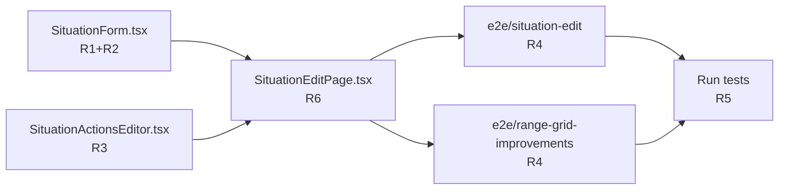

# Tasks — Replace Native `<select>` with shadcn Select

## Task Overview



## Execution plan

| #   | Task                                         | Reqs   | File(s)                                                             | Depends on | Parallel | Done when                                                                 | Gate                                                                                                         |
| --- | -------------------------------------------- | ------ | ------------------------------------------------------------------- | ---------- | -------- | ------------------------------------------------------------------------- | ------------------------------------------------------------------------------------------------------------ |
| T1  | Replace 2 `<select>` in SituationForm        | R1, R2 | `src/renderer/src/components/situations/SituationForm.tsx`          | —          | [P] T2   | `control` prop added, groupId and position use shadcn Select + Controller | `pnpm test:unit` compila sem erro de tipo                                                                    |
| T2  | Replace `<select>` in SituationActionsEditor | R3     | `src/renderer/src/components/situations/SituationActionsEditor.tsx` | —          | [P] T1   | `control` prop added, actionType uses shadcn Select + Controller          | `pnpm test:unit` compila sem erro de tipo                                                                    |
| T3  | Wire `control` in SituationEditPage          | R6     | `src/renderer/src/pages/SituationEditPage.tsx`                      | T1, T2     | —        | `control` passado para ambos componentes                                  | `pnpm test:unit` passa                                                                                       |
| T4  | Update e2e/situation-edit.spec.ts            | R4     | `e2e/situation-edit.spec.ts`                                        | T3         | [P] T5   | `selectOption` → `selectShadcnOption` na linha 80                         | `pnpm exec playwright test e2e/situation-edit.spec.ts` passa                                                 |
| T5  | Update e2e/range-grid-improvements.spec.ts   | R4     | `e2e/range-grid-improvements.spec.ts`                               | T3         | [P] T4   | `selectOption` → `selectShadcnOption` na linha 18                         | `pnpm exec playwright test e2e/range-grid-improvements.spec.ts` passa                                        |
| T6  | Run full test suite                          | R5     | —                                                                   | T4, T5     | —        | `pnpm test:unit` + ambos E2E passam                                       | `pnpm test:unit && pnpm exec playwright test e2e/situation-edit.spec.ts e2e/range-grid-improvements.spec.ts` |

**Legend:** `[P]` = pode rodar em paralelo

## Patterns & conventions

### Controller pattern (use inside components)

```tsx
import { Controller, type Control } from 'react-hook-form';

// Dentro do JSX:
<Controller
  control={control}
  name="groupId"
  render={({ field }) => (
    <Select
      value={field.value === 0 ? '' : String(field.value)}
      onValueChange={(val) => field.onChange(val === '' ? 0 : Number(val))}
    >
      <SelectTrigger id="situation-group" data-testid="situation-group-select">
        <SelectValue placeholder="Selecione um grupo…" />
      </SelectTrigger>
      <SelectContent>
        {groups.map((g) => (
          <SelectItem key={g.id} value={String(g.id)}>
            {g.name}
          </SelectItem>
        ))}
      </SelectContent>
    </Select>
  )}
/>;
```

### Key behaviors to preserve

| Native behavior                                                            | shadcn equivalent                                                                         |
| -------------------------------------------------------------------------- | ----------------------------------------------------------------------------------------- |
| `<option value="">Selecione um grupo…</option>` desabilitado via validação | `placeholder="Selecione um grupo…"` no `<SelectValue>`, grupo 0 mapeado para string vazia |
| `setValueAs: (value) => value === '' ? 0 : Number(value)`                  | `onValueChange` faz o mesmo cast                                                          |
| `aria-invalid={errors.groupId ? true : undefined}`                         | `aria-invalid` no `SelectTrigger`                                                         |
| `data-testid="situation-group-select"`                                     | `data-testid` no `SelectTrigger`                                                          |

### Native imports to add

```tsx
// SituationForm.tsx e SituationActionsEditor.tsx
import { Controller, type Control } from 'react-hook-form';
import {
  Select,
  SelectContent,
  SelectItem,
  SelectTrigger,
  SelectValue,
} from '@/components/ui/select';
```

## Verification

```bash
# Unit tests (rápido)
pnpm test:unit

# E2E tests específicos (precisa de build primeiro)
pnpm build:app
pnpm exec playwright test e2e/situation-edit.spec.ts e2e/range-grid-improvements.spec.ts
```
